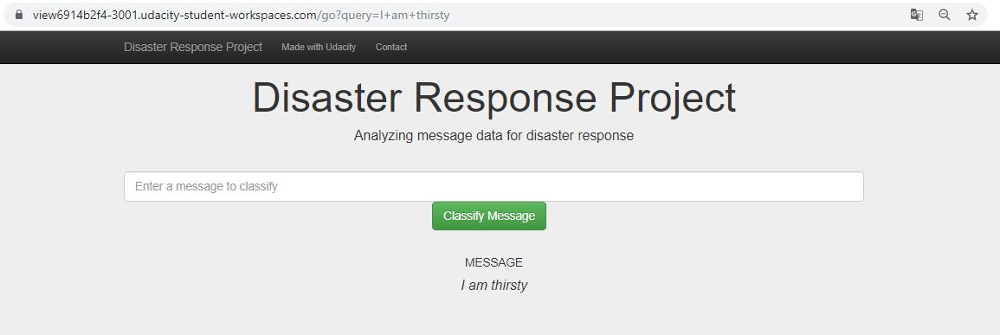
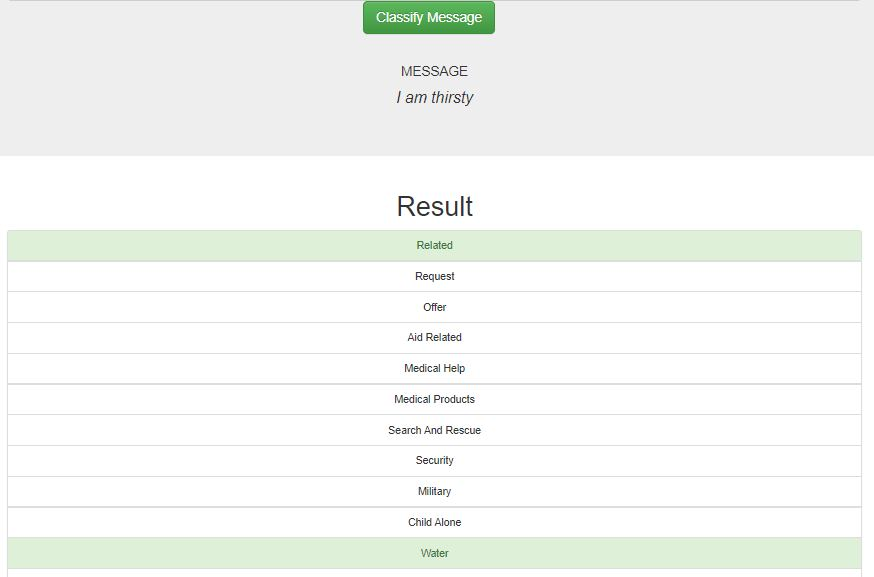
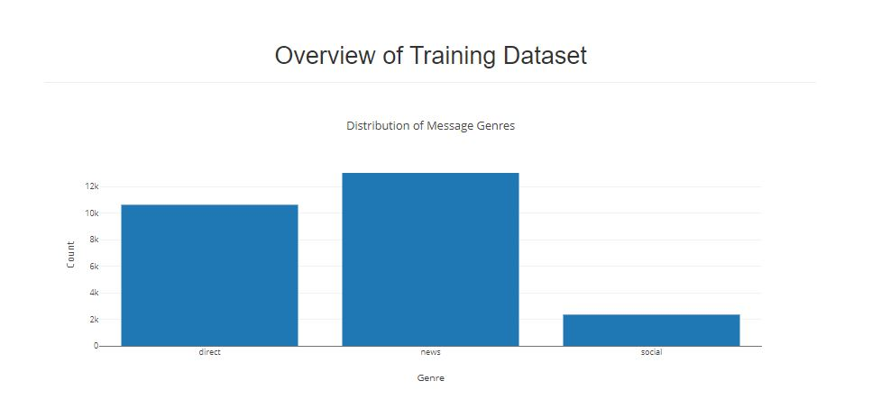
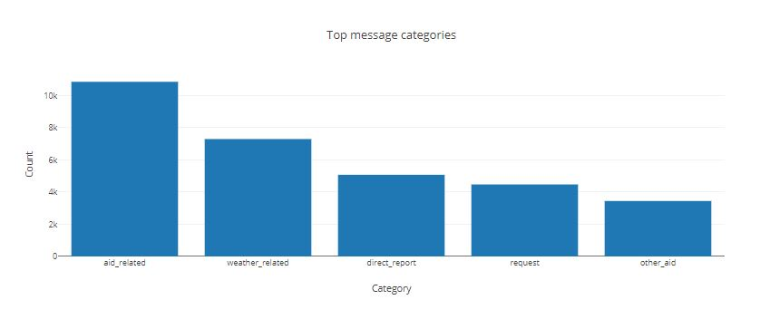
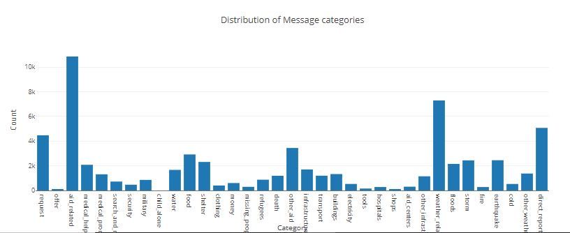

# Disaster Response Pipeline Project 
### (Udacity Data Science Nanodegree)

In this project, I'll be applying data engineering skills to analyze disaster data from Figure Eight to build a model and classify disaster messages.

data directory contains a data set containing real messages that were sent during disaster events. I'll deploy a machine learning pipeline to categorize these events so that appropriate disaster relief agency can be reached out for help.

The project includes a web app where an emergency worker can input a new message and get classification results in several categories. The web app will also display visualizations of the data.

## Table of Contents

- [1. Project Components](#component)
   - [1.1 ETL Pipeline](#etl)
   - [1.2 ML Pipeline](#ml)
   - [1.3 Flask Web App](#flask)
- [2. Content](#content)
- [3. Screenshots](#screen)
- [4. Instructions](#inst)
- [5. Credits and Acknowledgements](#credits)

***

## 1. Project Components

There are three components of this project:

### 1.1. ETL Pipeline

- Loads the `messages` and `categories` dataset
- Merges the two datasets
- Cleans the data
- Stores it in a SQLite database

### 1.2. ML Pipeline

- Loads data from the SQLite database
- Splits the data into training and testing sets
- Builds a text processing and machine learning pipeline
- Trains and tunes a model using GridSearchCV
- Outputs result on the test set
- Exports the final model as a pickle file

### 1.3. Flask Web App

- displaying the results in a Flask web app

## 2. Content
- Data
  - process_data.py: reads in the data, cleans and stores it in a SQL database. 
  - disaster_categories.csv and disaster_messages.csv (dataset)
  - DisasterResponse.db: created database from transformed and cleaned data.
- Models
  - train_classifier.py: includes the code necessary to load data, transform it using natural language processing, run a machine learning model using GridSearchCV and train it. 
- App
  - run.py: Flask app and the user interface used to predict results and display them.
  - templates: folder containing the html templates.

## 3. Screenshots

&nbsp;
  &nbsp;

&nbsp;

&nbsp;
  &nbsp;

&nbsp;

&nbsp;
  &nbsp;

&nbsp;

&nbsp;
  &nbsp;

&nbsp;

&nbsp;
  &nbsp;

&nbsp;

## 4. Instructions

1. Run the following commands in the project's root directory to set up your database and model.

    - To run ETL pipeline that cleans data and stores in database
        `python data/process_data.py data/disaster_messages.csv data/disaster_categories.csv data/DisasterResponse.db`
    - To run ML pipeline that trains classifier and saves
        `python models/train_classifier.py data/DisasterResponse.db models/classifier.pkl`

2. Run the following command in the app's directory to run the web app.
    `python run.py`

3. Now, open another Terminal Window and type : env|grep WORK

4.  In a new web browser window, type in the following: https://SPACEID-3001.SPACEDOMAIN (notice that the SPACEID and SPACEDOMAIN are given by the command in step 3 )

## 5.Credits and Acknowledgements
Must give credit to Figure Eight for the data.

